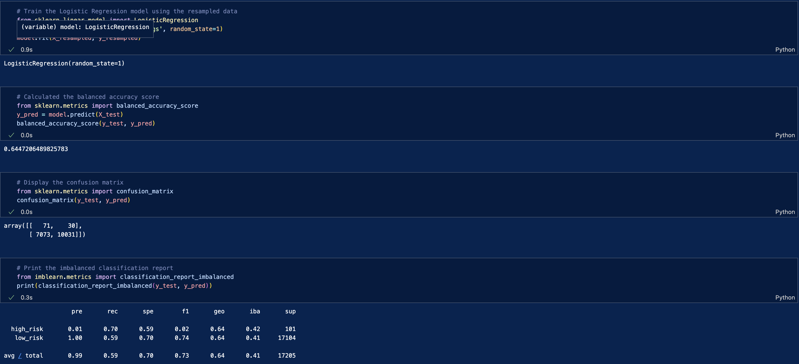
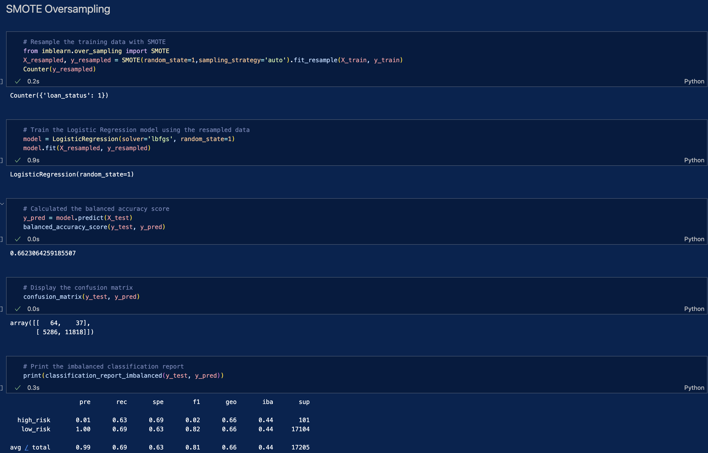
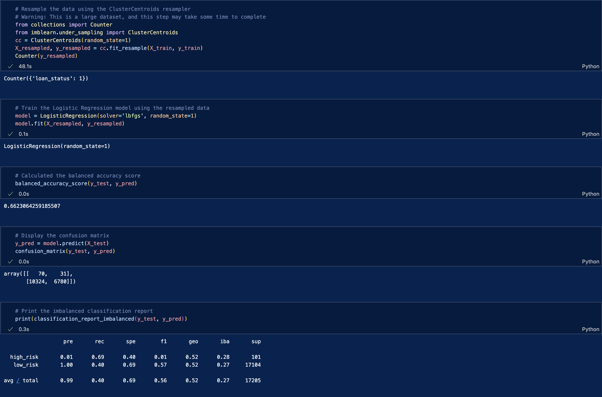
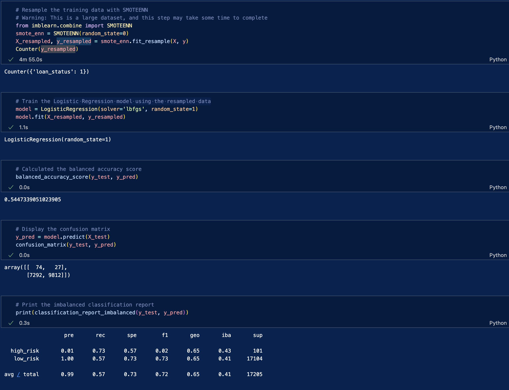

# Credit_Risk_Analysis

## Overview of the analysis: 

It is very difficult to predict credit risk. In this project, let's see how all the factors in the [LoanStats_2019Q1](./LoanStats_2019Q1.csv) CSV file can help us predict who is at high or low risk. One of the methods that data scientists use to solve this kind of problem is to create a model, score, and train the created model. This particular project uses the imbalanced-learn and scikit-learn libraries to build the model and uses resampling methods to evaluate the model. The first model oversampled the data using the RandomOverSampler and SMOTE algorithms and undersampled the data using the clustercentroid algorithm. The remaining models used a combined approach of oversampling and undersampling the data using smotenn. Finally, we compared two machine learning models that minimize bias: BalancedRandomForestClassifier and EasyEnsembleClassifier. 

## Results: 

- Naive RandomOversampling results: Our balanced accuracy test it 64%, the precision for the high_risk has a very low positivity at 1% and the recall is 74%

- SMOTE oversampling results: the accuracy score is 66.2%, the precision for the high_risk loans has a low positvity again at 1% and recall is 69% overall

- Undersampling results: balanced accuracy score is 66.2% overall, the precision is at 99% and the recall is 40%

- Combination(over and undersampling) results: balanced accuracy score is 54.7% the precision is 99% and the recall is 57% overall

- Balanced Random Forest Classifier results: the accuracy score is 77.2% the precision is 99% and the recall is 88%

- Easy Ensemble AdaBoost Classifier results: the accuracy score is 91.7% the precision is 99% and the recall is 94%

## Summary: 

Based on the evaluation metrics provided, it appears that the Easy Ensemble AdaBoost Classifier model performs the best out of all the models tested. It has the highest accuracy score, precision, and recall.

The precision for the high_risk loans in all the models is consistently low, which indicates that there are a lot of false positives (i.e. the model predicts a loan is high risk when it's actually low risk). However, the Easy Ensemble AdaBoost Classifier has the highest recall score for high_risk loans, which means that it correctly identifies a higher proportion of the actual high-risk loans.

Overall, it seems that the ensemble-based methods (i.e. Balanced Random Forest Classifier and Easy Ensemble AdaBoost Classifier) perform better than the other methods (i.e. naive random oversampling, SMOTE oversampling, and undersampling) in this particular dataset. It's important to note that the evaluation metrics provided do not give a complete picture of model performance, and other factors such as computation time and data characteristics should also be considered when selecting a model.